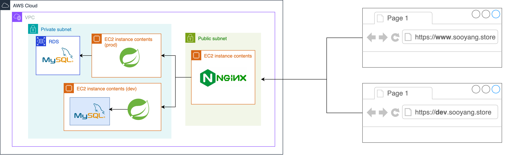

# 인프라

### 구성 요소

- 동일 VPC 상 두 대의 private ec2(dev/prod)
- 한 대의 public ec2(웹서버/리버스 프록시)
- private rds

### 웹 서버(리버스 프록시 서버)

리버스 프록시 서버 및 개발/운영 서버 분리로 nginx 웹 서버를 도입했습니다.
AWS ALB와 웹 서버라는 선택지가 있었으나 여러 대의 ec2를 로드 밸런싱할 정도로 프로젝트 규모가 크지 않았기 때문에 웹 서버를 채택했습니다. 

웹 서버는 외부와 직접적으로 통신하는 창구 역할이므로 public subnet에 위치시켰습니다. 

### 개발 서버

개발 서버와 운영 서버 모두 private subnet에 위치시켜 동일 VPC에 존재하는 웹 서버를 통해서만 접근할 수 있도록 설정했습니다. 
기존 프로젝트를 public subnet에 위치시켰을 때 신원을 파악할 수 없는 크롤러에 의한 무작위 요청으로 인해 로그 관리에 어려움을 겪었습니다.
따라서 개발 및 운영 서버는 외부에 최대한 노출시키지 않게 하여 최소한의 보안을 챙겼습니다.

dev 서버는 개발 서버 특성 상 DB 스키마 변경이 잦고 데이터를 영구적으로 보존하기 힘든 환경이라고 보았습니다.
따라서 고가용성을 고려한 DB 분리보단, 동일 ec2 내에서 docker-compose를 통한 네트워크 격리로 DB를 분리했습니다.

### 운영 서버

prod 서버는 실제 운영하는 서버이기 때문에 데이터베이스의 고가용성을 중요하게 생각했습니다. 따라서 DB를 RDS로 격리시켰습니다.

# **PT 예약 서비스**

담당 선생님과 PT 일정을 잡기 힘들어서 만들었어요. 😢

### 1. **무엇을 하나요?**

헬스장 운영 방침에 따라 PT 수업을 예약할 수 있어요.

### 2. **필수 기능**

- 사용자 별로 남은 PT 횟수가 있다면 **담당 선생님**의 남은 시간대를 골라서 예약할 수 있어요.
- 이미 선택된 시간대라면 예약 대기를 걸 수 있어요.
- 모든 사용자는 예약 현황을 확인할 수 있어요.
- 사용자 본인은 자신이 한 예약의 상세 정보까지 확인할 수 있어요.
- 사용자는 본인의 예약만 수정하고 삭제할 수 있어요.

> **헬스장 운영방침**
>    - 내 담당 선생님의 수업만 들을 수 있어요.
>    - 수업 하루 전부터는 수업을 취소해도 수강권이 차감돼요.

---

## 기능 구현 목록

- [x] 회원가입/로그인
    - [x] 회원가입 시 랜덤으로 닉네임을 생성한다
    - [x] 회원가입 시 2번의 무료 PT 횟수를 제공한다
- [x] 담당 선생님을 지정한다
- [x] 선생님 별 예약 현황을 확인한다
- [x] 수업을 예약한다
    - [x] 내 담당 선생님의 수업만 예약할 수 있다
    - [x] 남은 PT 횟수가 있어야 예약할 수 있다
    - [x] 예약에 성공하면 PT 횟수가 1회 차감된다
    - [x] 이미 예약된 시간대라면 예약 대기로 등록된다
        - [x] 이 때 PT 횟수는 차감되지 않는다
- [x] 수업 예약을 취소한다
    - [x] 수업을 취소하면 PT 횟수가 복구된다
    - [x] 수업 하루 전부터 수업을 취소해도 PT 횟수가 복구되지 않는다
- [x] 수업 대기를 취소한다
    - [x] 수업 대기는 기간에 상관없이 취소할 수 있다
- [x] 내 예약과 대기 현황을 확인한다